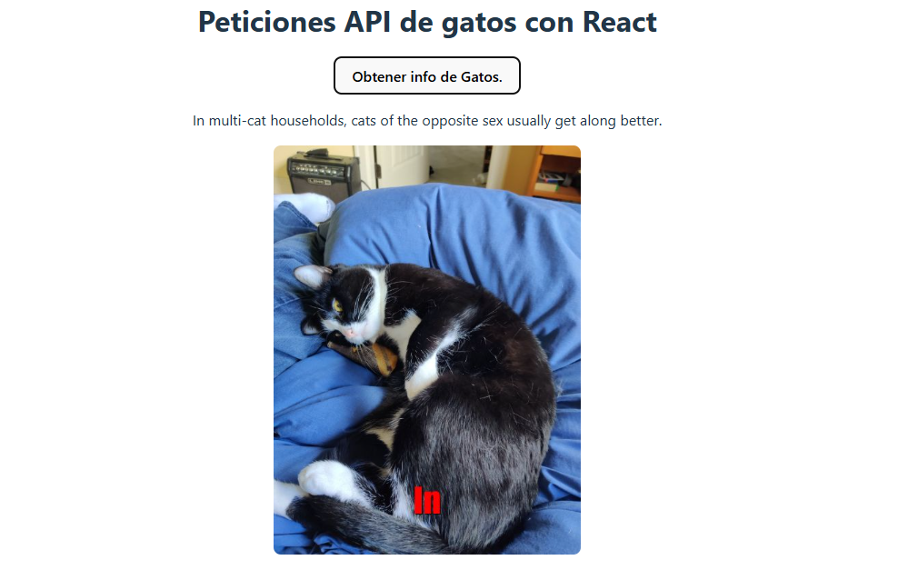
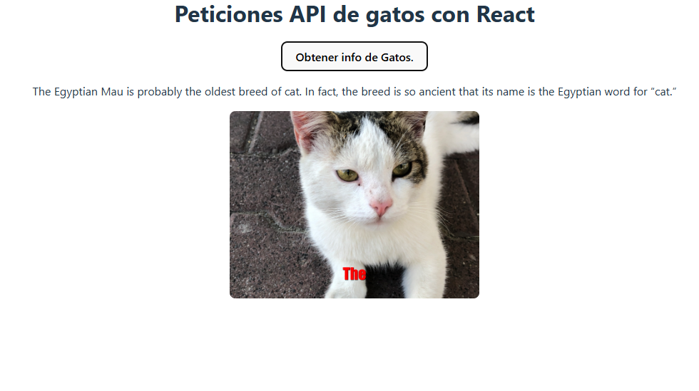

## Ejercicio React useState, useEffect y Custom Hooks.
APIs:

- Facts Random: https://catfact.ninja/fact

- Imagen random: https://cataas.com/cat/says/hello

- Recupera un hecho aleatorio de gatos de la primera API

- Recuperar la primera palabra del hecho

- Muestra una imagen de un gato con la primera palabra.

- Luego de tener lo esperado intentar refactorizar e implementar hooks para reutilizar logica.

